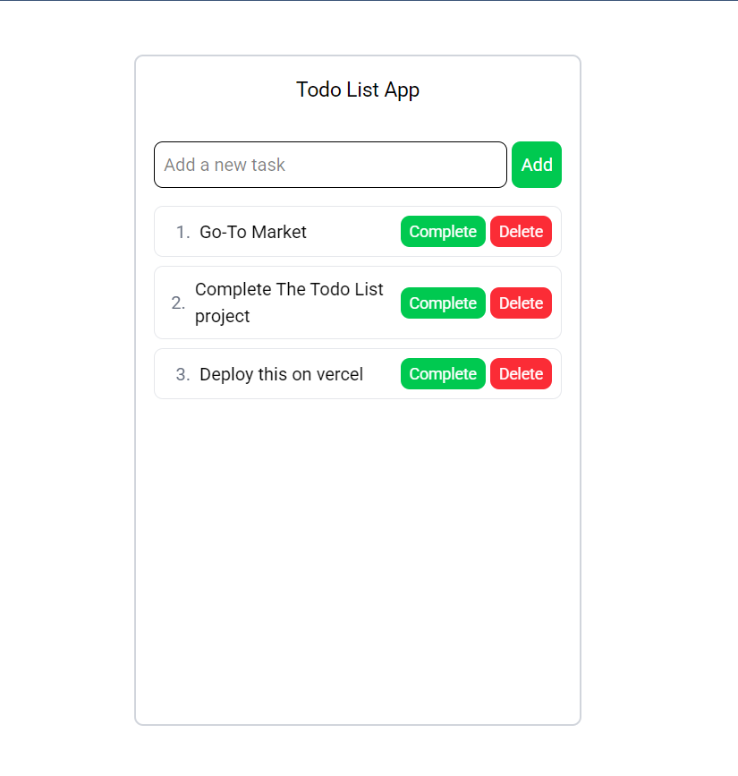

# React Todo List Application



A feature-rich todo list application built with React that allows you to:
- Add new tasks
- Mark tasks as complete
- Delete tasks
- Reorder tasks via drag-and-drop
- View tasks with position numbers

## Features

✅ **Task Management**
- Add new tasks with validation
- Delete tasks with confirmation
- Toggle task completion status

🔄 **Drag-and-Drop Reordering**
- Intuitive drag handles
- Smooth animations during reordering
- Immediate position updates

🎨 **Clean UI**
- Responsive design
- Visual feedback for actions
- Scrollable task list

## Installation

1. Clone the repository:
   ```bash
   git clone https://github.com/raza-shahi/react-todo-list.git

## Contact

Shahid Raza - [linkedin.com/in/shahid-raza-7a54b3185](https://www.linkedin.com/in/shahid-raza-7a54b3185/)

Project Link: https://github.com/raza-shahi/react-todo-list

